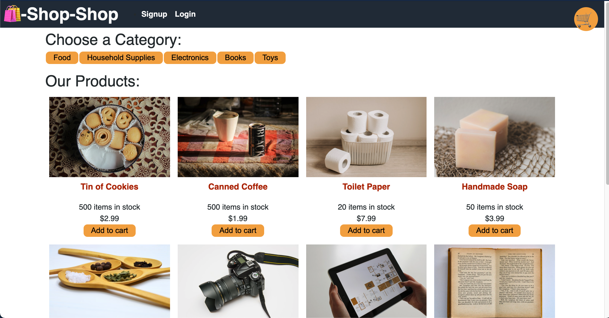

# Shop-Shop 

## Description
Shop-Shop is an full-fledged eCommerce website that allows customers to filter porducts by category, add product to cart, remove products from cart, recall abandoned carts, checkout via Stripe, and view previous orders. 

## Table of Contents
- [Installation](#Installation)
- [Usage](#Usage)
- [License](#License)

## Installation
Shop-Shop doesn't need any installation from a User's end. Simply visit https://clu-redux-shop-shop.herokuapp.com/ ! 

## Usage
Shop-Shop utilizes React, Apollo, MongoDB, Express, and Redux to provide a seamless, easy-to-manage user and developer experience. The app is best suited for businesses who desire a digital presence or developer looking for a template to quickly create or scale an eCommerce app.

## License
This application is under the MIT license.

## Screenshot

## Questions
Github: https://www.github.com/Clu-Codes
If you have additional questions, please feel free to reach out to me at Clu.Codes@gmail.com.